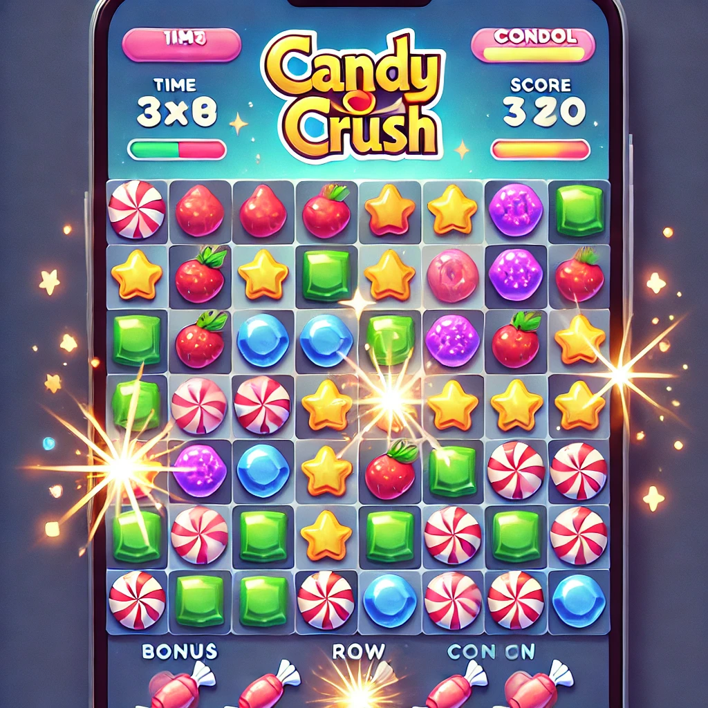

# React Native Candy Game 🍬

A simple match-3 style game (Candy Crush clone) built using **React Native + TypeScript**.

## 🔥 Features

- 🎮 8x8 candy grid
- 🧠 Match-3 logic (horizontal + vertical)
- 🧾 Scoring system
- 🕐 Time limit per level
- 📈 Multiple levels with increasing difficulty
- 🗨 Multilingual text support via props
- 💾 Score & level saving with AsyncStorage
- ⏳ Mini splash screen with optional text translation
- 🍬 Bonus candies (row and column destroyers)

## ✨ Coming Soon

- 🔊 Sound effects  
- 🎞 Better animations  
- 📜 Level selector screen (already available in `LevelSelectScreen`)

---

## 📦 Installation

```bash
npm install react-native-candy-game
```

---

## 📱 Basic Usage

```tsx
import { CandyGameScreen } from 'react-native-candy-game';

<CandyGameScreen
  level={1}
  translations={{
    scoreLabel: 'Рахунок',
    timeLeftLabel: 'Час',
    finalScoreLabel: 'Підсумковий рахунок',
    gameOverText: 'Гра завершена!',
    loadingLevelText: 'Завантаження рівня...',
  }}
  onScoreSaved={(score) => console.log('Score:', score)}
/>
```

---

## 🌍 Multilingual Support

All UI texts can be translated via the `translations` prop:

| Prop Key              | Default (English)           |
|-----------------------|-----------------------------|
| `scoreLabel`          | Score                       |
| `timeLeftLabel`       | Time Left                   |
| `finalScoreLabel`     | Final Score                 |
| `gameOverText`        | Game Over!                  |
| `levelCompleteText`   | Level Complete!             |
| `nextLevelText`       | Next Level                  |
| `retryText`           | Retry                       |
| `loadingLevelText`    | Loading your level…         |

---

## 🔁 Level Persistence

- The game remembers your last level using `AsyncStorage`.
- Automatically resumes from the saved level on app launch.

---

## 📂 Optional: Use Level Selector with Navigation

```tsx
import { CandyGameScreen, LevelSelectScreen } from 'react-native-candy-game';
import { createStackNavigator } from '@react-navigation/stack';

const Stack = createStackNavigator();

<Stack.Navigator>
  <Stack.Screen name="LevelSelectScreen" component={LevelSelectScreen} options={{ title: 'Choose Level' }} />
  <Stack.Screen name="CandyGameScreen" component={CandyGameScreen} options={{ title: 'Candy Game' }} />
</Stack.Navigator>
```

---

## 💡 Bonus Candies

Special candies randomly appear during the game:
- 🍬 **Row Destroyer Candy** – clears entire row
- 🍬 **Column Destroyer Candy** – clears entire column

Customize their images in `./assets/bonus_row.png` and `bonus_col.png`.

---

## 🎥 Gameplay Preview



---

## 📫 Contributions

Pull requests, suggestions and issues are very welcome!
